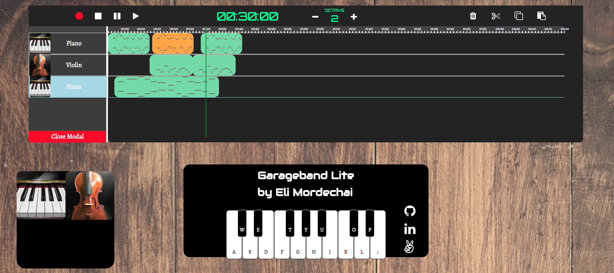
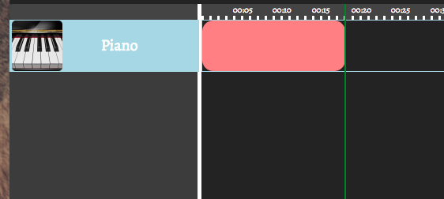

## Garageband Lite
 *clone of the popular Mac OS X Garageband app*
 
 

[Live](https://elimor5.github.io/garageband-lite/)

###components

Garageband Lite consists of two main components: the recording dashboard and the keyboard.

Users can play music on the keyboard by either clicking on a key or by using the computer keyboard.  Instruments can be added/changed by clicking on the "Add Instrument" button,  adding the instrument to the recording dashboard.

###Playing Notes

When the dashboard isn't recording, users can produce sounds by clicking on the screen keyboard or by using the computer keyboard to create music. This is accomplished by calling play() on an html5 audio object.

```javascript
//components/key.js
startPlay() {
  if (!this.soundFileMissing) {
    this.sound.play();
    this.keyDiv.addClass("opacity");
  }
}
```

 Event listeners are in place to track when the sound has begun and what octave and note is playing. When the keyboard is created, keys are individually initialized. It his here where the program  looks into the piano samples folder to find the sound file corresponding to the note played and its octave. This function is called again when the instrument is changed or when the octave is changed.

 ```javascript
 //components/key.js
 setAudio(instrument) {
   const note = this.note.slice(0,1).toUpperCase();
   const sharp = (this.note[this.note.length-1] === "#") ? "s" : "";
   const octave = this.note[1] === "2" ? this.octave + 1 : this.octave;
   const url = `assets/${instrument}_samples/${octave}${note}${sharp}.mp3`;
   ...

 }
```

  When the user lets go of the key or mouse, the same html5 audio object that is currently playing then calls load(), effectively stopping playback and reverting the audio file back to its start time.

 ```javascript
 //components/key.js
 endPlay() {
   if (!this.soundFileMissing) {
     this.sound.load();
     this.keyDiv.removeClass("opacity");
   }
 }
 ```

###Recording

When the user begins recording, a few things happen. First, a new recording object is created and appended to the selected instrument (highlighted in light blue).

 

```javascript
//components/timer.js
createNewRecording() {
  this.currentRecording = new Recording(this.dashboard, this.totalElapsedTime);
  this.dashboard.recordingSuite.push(this.currentRecording);
  this.currentRecording.mapRecordingToKeys();
}
```

 This recording object is a linked list, inheriting from the linked list class (or "prototypially inherited" , for those of you yelling at the screen saying that javascript doesn't have classes!)

```javascript
// components/recording.js
export default class Recording extends LinkedList {
  constructor(dashboard, startTime) {
    super();
    this.keyboard = dashboard.keyboard;
    this.dashboard = dashboard;
    ...
  }
  ...
}
```


When a note is pressed, a soundbyte node object is created and immediately appended to the current recording linked list. The soundbyte keeps a reference to the time the soundbyte was created, the note that was played, its octave, and the instrument that played the note.

```javascript
  // components/key.js
addListener(element,listener, startFunc, endFunc) {
  ...

  element.on(`${listener}down`, (e) => {
    e.stopPropagation();
    if (listener === "mouse" || e.key === currentKeyChar) {
      if (this.currentRecording && !this.currentSoundByte && !this.soundFileMissing) {
        this.currentSoundByte = new SoundByte(this, this.currentRecording);
      }
    ...
    }
  });
}    
```

```javascript
  //components/sound_byte.js

export default class SoundByte extends Node {
  constructor(key, recording) {
    super();
    this.startTime = recording.timer.totalElapsedTime;
    this.endTime = null;
    this.recording = recording;
    this.key = key;
    this.yPos = null;
    this.startXPos = null;
    this.endXPos = null;
    this.note = null;
    this.octave = this.key.octave;
    this.sound = this.key.sound;
    this.addToRecording(this.recording);
    this.getStartPositions();
  }
  ...
}
```


 When the key is released, the soundbyte tracks the time when the soundbyte ended and draws a  line on the recording within the dashboard to indicate at what start and end time the soundbyte was recorded, and which note was played.

```javascript
  //components/key.js

  element.on(`${listener}up`, (e) => {
    e.stopPropagation();

    if (listener === "mouse" || e.key === currentKeyChar) {
      if (this.currentRecording && !this.soundFileMissing) {
        this.currentSoundByte.getEndPos();
        this.currentSoundByte.drawLine();
        this.currentSoundByte = null;

      }

    ...
    }
  });
  ```

  ```javascript
  //components/sound_byte.js
createNote() {
  const { visual } = this.recording;

  this.note = $("<div/>", {
    class: "note"
  });

  this.note.css("left", this.startXPos);
  this.note.css("top", this.yPos);
  this.note.css("width", this.endXPos - this.startXPos);


  visual.append(this.note);
}

```


The dashboard contains a ticker, which tracks how much time has elapsed in the song based on the distance from the beginning of the dashboard div. Every pixel to the right of the origin corresponds to one hundred milliseconds.

```javascript
//ticker.js

addTick(time) {
  const leftPos = time;
  const ticker = $("#timer-ticker");
  const newTick = $('<div/>', {
    class:"tick",
  });
  newTick.css("left", `${leftPos}px`);

  this.addTickTime(time);

  ticker.append(newTick);
 }
```
 Clicking on the ticker will track this offset and set the current time by multiplying the pixels away from the origin by 10. (ie. 1000 px = 100 seconds, or 1 minute, 40 sec). A cursor is provided to track what the current time is corresponding to the location on the dashboard.

 ```javascript
  //components/ticker.js
 addEventListener() {
  ...
  ticker.on("click",(e) => {
    e.stopPropagation();
    let innerDivOffset = e.target.id !== "timer-ticker" ? e.target.offsetLeft : 0;
    let offset = e.offsetX + innerDivOffset;

    clearTimer();
    updateTimeVariables(offset);
    setCurrentTime();
    pauseTimer();

    cursor.seek(offset);
  });
}
```

###Recursive Algorithm

Garageband Lite harnesses the power of linked lists to easily append new soundbyte nodes in constant time. A recursive algorithm is implemented to traverse each node by calling itself on the node's child. A callback is called on each node. A similar function is used to call a callback on one specific node (based on a requested time). The recursive algorithm is utilized in playback and in manipulating recordings, as discussed further below.

  ```javascript
  //components/linked_list.js

  updateAllSoundBytes(time, soundByte, callback) {
    if (!soundByte) {
      soundByte = this.find(time);
    } else if (soundByte === this.head) {
      return this.updateAllSoundBytes(time, soundByte.nextNode, callback);
    } else if (soundByte === this.tail || soundByte === -1) {
      return;
    }

    callback(soundByte);
    return this.updateAllSoundBytes(time,soundByte.nextNode, callback);
  }
  ```

###Playback

Playback of the recorded soundbytes is accomplished by calling play on each individual soundByte. This is done for every recording in the dashboard.

```javascript
//components/recording.js

playRecordings() {
  const { recordings } = this.dashboard.recordingSuite;

  recordings.forEach((recording) => {
    if ((this.totalElapsedTime > recording.endTime) || (recording === this.currentRecording) ) {
      return;
    }
    recording.updateAllSoundBytes(this.totalElapsedTime, null, soundByte => soundByte.play());
  });
}
```

 A setTimeout asynchronous callback is initiated for each soundbyte in each recording, with the soundbyte's html5 audio object set to call play() and the timeout being the difference in time between the soundbyte's start time and the recording's start time. Similarly, a setTimeout function is nested in the original set timeout function to indicate when to stop playing the soundbyte.

```javascript
//components/sound_byte.js
play() {
  const { totalElapsedTime, timerRunning } = this.recording.timer;
  const startPlayTimeOffset = (this.startTime - totalElapsedTime  ) * 1000;
  const endPlayTimeOffset = (this.endTime - this.startTime) * 1000;
  var interval;

  interval = setTimeout(() => {
    if (totalElapsedTime > this.startTime) {
      const seek = totalElapsedTime - this.startTime;
      this.playSound(seek);
    } else {
        this.playSound();
    }

    setTimeout(() => {
    if (!this.key.soundFileMissing)  this.sound.load();
      this.recording.soundByteQueue.pop();
    }, endPlayTimeOffset);
  }, startPlayTimeOffset);

  this.recording.soundByteQueue.push(interval);
}
```

###Asynchronous Playback

Asynchronous callbacks allow for soundbytes to be played simultaneously in the dashboard. In other words, the strings instrument can be playing while the piano is playing in the background. Both will play together seamlessly without having to wait for one soundbyte to end before the next one plays.


###Recording Manipulation

My goal was to give the user as close of a Garageband UX as possible, which meant including the ability to copy and paste recordings, split a recording into 2 separate recordings, delete a recording, or simply moving a recording to a different start time. Recursively traversing each soundbyte node within each modified recording was a requirement, because modifying the recording alone was not going to modify the soundbytes.

 

###Copying Recordings

One issue I faced was with cloning recordings. Just copying the object did nothing but create a reference to the original object that was copied, which meant that any further modification to the original would modify the copy as well. No good. The solution was to create a new recording, copying the properties of  the original recording and setting them as properties of the copied recording. I did the same for each soundbyte of the original recording, creating new soundbytes and copying all the properties of the originals.

```javascript
//components/recording_suite.js

copyRecording(selectedRecording) {
  const { timer, dashboard, startTime, endTime, nodes, selectedInstrument } = selectedRecording;
  dashboard.updateSelectedInstrument(selectedInstrument);

  const copiedRecording = new Recording(dashboard, startTime);
  const copiedSoundBytes = selectedRecording.dupSoundBytes(copiedRecording);

  copiedRecording.endTime = endTime;
  return copiedRecording;
}

//components/recording.js

dupSoundBytes(newRecording) {
  const newSoundBytes = [];

  this.updateAllSoundBytes(this.startTime, null, (soundByte) => {
    const dup = new SoundByte(soundByte.key, newRecording);
    dup.startTime = soundByte.startTime;
    dup.endTime = soundByte.endTime;
    dup.updateStartEndPosition(0);
    newSoundBytes.push(dup);
  });
  return newSoundBytes;
}
```


###Moving a Recording

Moving a recording was relatively simple. I made each recording draggable by setting the draggable property of the recording's div to true.

```javascript
// components/recordings.js
createVisual() {
  const startPosition = this.updateStartPosition();
  this.visual = $("<div/>", {
   id: this.id,
   class: "sound-byte-visual"
  });
  this.visual.css({ left: `${startPosition}` });
  this.visual.attr({draggable: "true"});
  return this.visual;
}
```


I then added an event listener "ondragend" to the dashboard to find the recording that corresponds to the div that was dragged and then changed the recordings start/end times, as well as its corresponding soundbytes' start/end times to match the distance of where the dragging ended to the beginning of the dashboard div, multiplied by 10 to convert the pixels into time.

```javascript
// components/instrument.js
createDragoverEvent() {
  this.soundByteContainer[0].ondragend = (e) => {
    e.preventDefault();
    const targetVisual = e.target;
    const offset = e.offsetX;

    this.recordingSuite.moveRecording(targetVisual, offset);
  };
}


//components/recording_suite.js
moveRecording(targetVisual, offset ) {
  this.recordings.forEach((recording) => {
    const { currentRecording } = recording.timer;

    if (recording.visual[0] === targetVisual && !currentRecording) {
      const startTime = recording.startTime * 10;
      let offsetFromStartPos = startTime + offset;
      
      if (offsetFromStartPos < 0) offsetFromStartPos = 0;

      recording.setRecordingStartPos(offsetFromStartPos);
    }
  });
}

```

###Plans for future updates

My plans for future updates include adding the ability to zoom into the dashboard to be able to view up to 16th notes and manipulate on a granular level. I also would like to implement a backend to be able to save the recordings and perhaps make them downloadable as mp3s. I would like to add a metronome as well to be played when recording.
